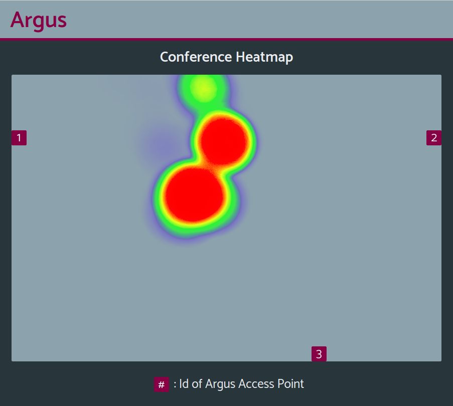

# User Interface Specification

### Design

Figure 1: Screenshot of the user interface featuring the heatmap concentration of wireless devices on the mesh network.

### Specification
* Labels
  * Title ("Argus"): title of the user interface and overall project
  * Header ("Conference Heatmap"): header denoting the purpose of the graph as it relate to our primary use case.
  * Legend ("Id of Argus Access Point"): legend describing the purpose of the squares alotted on the map for the network access points.
* Map
  * The background of the canvas depicting the network map of access points.
* Access Points
  * The three numbered squares on the map depicting each of the network access points and their locations.
* Heatmap
  * The colored portions of the canvas depicting the approximate locations of wireless devices on or nearby our establish network; warmer colors indicate a larger concentration of devices.