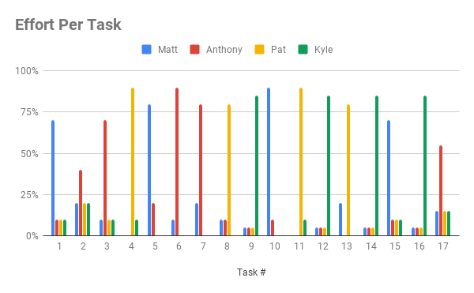

## Milestones
### 1. Set up hardware
Determine hardware requirements for the project and implement basic set up of components from project design including access points, central server, and possibly a client device for testing purposes.

### 2. Create modules
Create modules defined in the project design. Define classes for each stage of the data processing module. Set up web server to communicate with message queue, client device, and data processing module. Set up web framework to be used for user interface on client device.

### 3. Collect and extract data
Write class to monitor, capture, and filter packets received from access points. Write algorithm to scan packets and parse out relevant data for location processing.

### 4. Process location
Research methods of efficient device location triangulation/trilateration. Write algorithm to use RSSI and ToF to calculate target device's location from extracted data.

### 5. Set up communications
Establish message queue and in-memory data management system to prepare and store location data on web server. Implement communication pathways between web server and client device.

### 6. Implement user interface
Design and develop the user interface for the client device, including features listed previously like device location and information listing. Create configurable notification system based on status of target devices or access points. Generate a method for setting up facility map of access points for end user.

### 7. Test and document project
Perform unit and integration tests of all modules in the project design. Document project according to course assignments. Conduct end user tests to gather feedback, document necessary instructions, and adjust implementation accordingly.

----
## Timeline
| Task # |                                                       Description                                                      | Start Date |  End Date  | Prerequisite | Milestone |
|:------:|:----------------------------------------------------------------------------------------------------------------------:|:----------:|:----------:|:------------:|:---------:|
|    1   |                    Research triangulation/trilateration methods and prior work relevant to project.                    | 2018-10-01 | 2019-01-16 |       -      |     4     |
|    2   |   Obtain required hardware components for project, such as access points, central server, and client/target devices.   | 2018-12-12 | 2019-01-16 |       -      |     1     |
|    3   |                       Manage documentation, requirements deadlines, and code testing for project.                      | 2019-01-16 | 2019-04-03 |       -      |     7     |
|    4   |                                        Set up web server within central server.                                        | 2019-01-16 | 2019-01-30 |       2      |     2     |
|    5   |                          Set up container for central server to be used in CI infrastructure.                          | 2019-01-16 | 2019-01-30 |       2      |     2     |
|    6   |                              Write module to capture and filter packets on central server.                             | 2019-01-16 | 2019-01-30 |       2      |     3     |
|    7   |                      Write module to process packets and retrieve relevant data on central server.                     | 2019-01-30 | 2019-02-13 |      2,6     |     3     |
|    8   |             Set up lightweight/in-memory data management system to store device information and locations.             | 2019-01-30 | 2019-02-13 |      2,4     |     5     |
|    9   |                Develop list view of nearby devices for client device to show general device information.               | 2019-01-30 | 2019-02-13 |       -      |     6     |
|   10   |                              Write algorithm to locate devices from processed packet data.                             | 2019-02-13 | 2019-02-27 |     1,2,7    |     4     |
|   11   |                        Generate communications module between central server and client device.                        | 2019-02-13 | 2019-02-27 |       2      |     5     |
|   12   |                    Develop display for client device to show nearby devices with map and distances.                    | 2019-02-27 | 2019-03-13 |       -      |     6     |
|   13   | Generate message queue from location processing module to the web server to efficiently provide updates to the client. | 2019-02-27 | 2019-03-13 |  2,4,8,10,11 |     5     |
|   14   |                             Create configurable push notification system for client device.                            | 2019-03-13 | 2019-03-27 |       9      |     6     |
|   15   |          Set up continuous integration (CI) infrastructure for seemless deployment and integration of modules.         | 2019-03-13 | 2019-03-27 |     2-13     |     7     |
|   16   |                                    Generate mobile friendly view for client device.                                    | 2019-03-13 | 2019-03-27 |     9,12     |     6     |
|   17   |                            Write and perform unit and integration tests for design modules.                            | 2019-03-27 | 2019-04-03 |     2-16     |     7     |

----
## Effort Matrix

